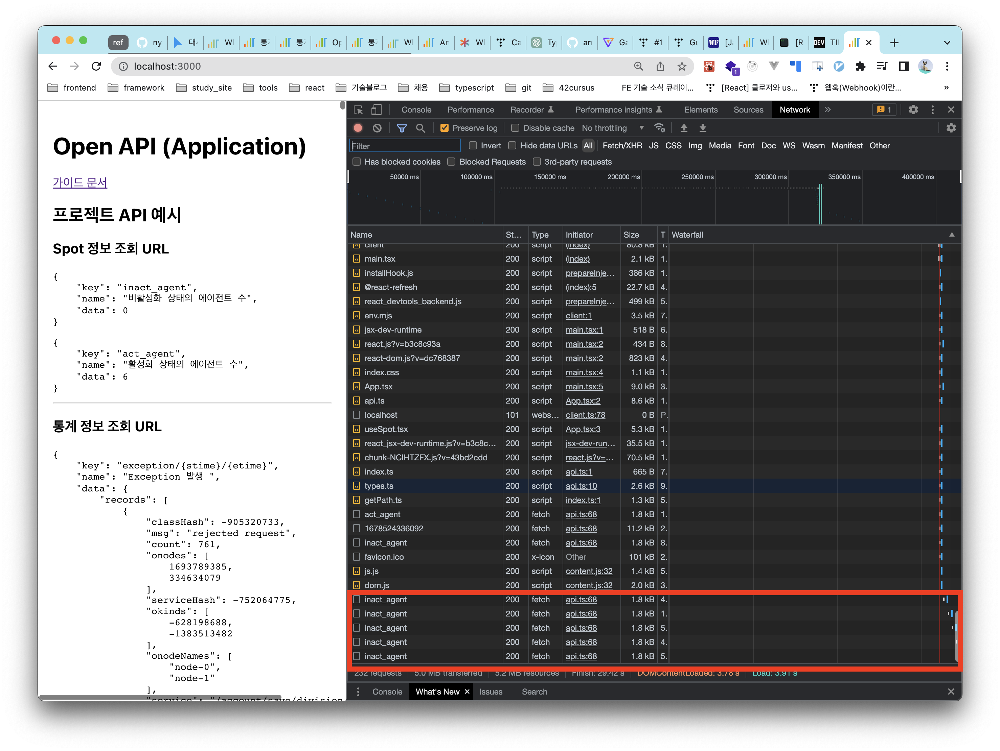
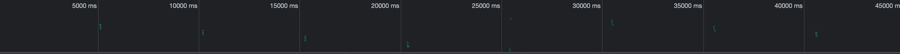

## Todo

- `Endpoint` 를 기준으로 10개이상의 open-api 사용하기
- 실시간 5초 주기로 데이터 갱신하기
- 3종류 (인포매틱스, 막대 차트, 라인 차트)의 5개 이상의 위젯

## Progress

### CRA to Vite

- 빠른 개발환경 + typescript 환경 설정을 위해서 `vite` migration 을 진행함
- `vite` : Start vite dev server in the current directory
- `vite build` : build for production
- `vite preview` : Locally preview production build

- `cors` 이슈 해결을 위해 `vite.config.ts` 에 proxy 설정
- https://velog.io/@zerone/Vite-Proxy-%EC%84%A4%EC%A0%95%ED%95%98%EB%8A%94-%EB%B2%95
- https://cathalmacdonnacha.com/migrating-from-create-react-app-cra-to-vite

### Type Alias 설정

기존에 정의되어있는 `OPEN_API` 에 `OpenApiType` 을 부여해주었고, `root("")` 와 `json("json")` 을 구분해주어 `OpenApiResponseType` 설정해주었다.

- `OpenApiType`

```javascript
export type rootKeyType = '';
export type jsonKeyType = 'json';

export const rootKey = '';
export const jsonKey = 'json';

// 'root' & 'json' 을 구분해주기 위함
export type OpenApiType = {
  [root in rootKeyType]: Record<string, string>;
} & {
  [json in jsonKeyType]: Record<string, string>;
};
```

- `OpenApiResponseType`

```javascript
export type OpenApiResponseType<T extends OpenApiKeyType> = {
  key: keyof OpenApiType[T];
  name: string;
  data: T extends rootKeyType ? RootDataType : JsonDataType;
};
```

### Api Call Logic

`api` 로직을 구현하기 전에 사전 만족해야하는 조건은 다음과 같다.

- 10개 이상의 `api` 사용
- 5초 주기로 데이터 갱신

그래서 10개 이상의 `api` 를 호출할때 `key` 만 주면 편하게 5초 주기로 데이터를 갱신해주는 `useSpot`, `useSeries` hook 을 만들기로 결정하였다.



### HTTP 429 error 처리하기

- HTTP 429 Too Many Requests Error 란?
  서버에서 유저가 단시간에 너무 많은 요청을 하려고 하면 `rate-limit` 을 걸게 된다.

- 먼저 /open/api/act\_\*\* 과 같은 api 가 데이터 갱신이 안되더라도 전체 페이지 렌더링이 일어나는 것을 확인할 수 있음

### API call 수 조절하기 위한 아이디어

먼저 한 컴포넌트에서 만든 `useSpot` 이나 `useSeries` 를 쓸 경우 아래의 사진처럼 5초 주기로 api 가 전체 fetching 되는 것을 확인 할 수 있다.


1. cache

- react-query or swr 사용할 때 캐시 작동되는 동작원리

2. debounce / throttling

3. token bucket algorithm

- throttling (rate limit)

4. lazy loading

If your dashboard has components that make API calls for data that may not be needed immediately, consider using lazy loading to defer the API calls until the data is actually needed. This can help reduce the number of API calls made on the initial page load.

### Dashboard 구성

- 인포메이션 차트

  - `act_agent` 활성화 상태의 에이전트 수
  - `inact_agent` 비활성화 상태의 에이전트 수
  - `host` 호스트 수
  - `cpucore` cpucore 합 수

-

### Chart 선정

- `antd-design-chart`
- `chart.js`
- `d3.js`

## TIL

### setTimeout vs setInterval

https://simsimjae.tistory.com/368

### Canvas API vs WebGL

- Canvas API
  `Canvas API` 는 javascript 와 HMTL `canvas` 엘리먼트를 통해 그래픽을 그릴 수 있는 수단을 제공하는 api 로 `html5` 의 구성요소이다.
  주로 2D 그래픽을 다루는 데 사용되고 있다.

- WebGL
  `WebGL` 은 웹 그래픽 라이브러리로 웹 상에서 2D 및 3D 그래픽을 랜더링하기 위한 로우 레벨 Javascript API이다.
  `OpenGL ES 2.0` 을 기반으로 브라우저 엔진에 내장된 HTML5 Canvas 요소 위에 그려진다.

https://nookpi.tistory.com/133
https://code-masterjung.tistory.com/110

### typescript arg 타입 추론

https://catchts.com/infer-arguments

### Fetch API 사용한 이유

- Interception Javascript fetch api requests and responses
  https://blog.logrocket.com/intercepting-javascript-fetch-api-requests-responses/

- `fetch` vs `axios` 비교
  https://velog.io/@eunbinn/Axios-vs-Fetch#fetch-%EB%B0%8F-axios%EC%97%90-%EB%8C%80%ED%95%9C-%EA%B0%84%EB%9E%B5%ED%95%9C-%EA%B0%9C%EC%9A%94

### 크롬 개발자도구

네트워크 탭

- type : 응답의 `content-type`
- initiator : 시작지점을 의미한다. `Other` 은 `root` 를 의미한다. 즉, 127.0.0.1 혹은 favicon 은 initiator 가 Other 이다.
- time : 응답이 끝나는 시점
- waterfall : 타임라인을 개략적으로 보여준다.

https://kamang-it.tistory.com/entry/WebPerformanceChrome-%EC%9B%B9-%ED%94%84%EB%A1%A0%ED%8A%B8%EC%9D%98-%EC%84%B1%EB%8A%A5%EC%9D%84-%EB%B3%B4%EC%9E%901-%ED%81%AC%EB%A1%AC-%EA%B0%9C%EB%B0%9C%EC%9E%90-%EB%8F%84%EA%B5%AC%EC%99%80-%EC%84%B1%EB%8A%A5-%EC%A7%80%ED%91%9C-%EB%B3%B4%EA%B8%B0

### .eslintcache 가 뭔가

### robots.txt 더 자세히 알아보기

### never type

- `typescript` 의 공집합이다.

### Notice

1. 3종류의 5가지의 위젯

- 429 에러 api 호출이 너무 많아서 발생하는 에러
- 429 에러가 발생하지 않게 구현하기

### 궁금했던 점

- server 의 max-rate-limit 이 알 수 있는 방법

- 비동기로 처리하는 것이 좋은 기준 정하기
